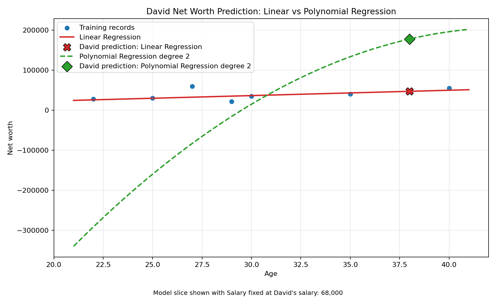
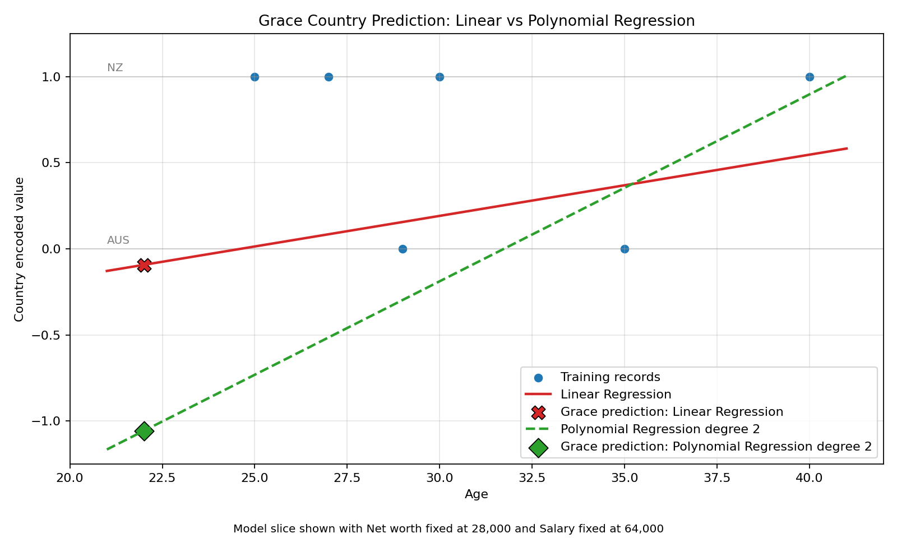

# Week 3 - Activity 2: Data Cleaning Prediction for Missing Value

## Objective

This activity continues the data cleaning work from Week 3 Activity 1. The goal is to retrieve or predict missing values where there is enough supporting data.

The selected missing values are:
- David's missing `Net worth`
- Grace's missing `Country`

Heidi is not predicted because she has several missing fields, so there are not enough reliable input features for regression-based prediction.

## Method

Two models were compared:
- Linear regression
- Non-linear regression using polynomial features with degree 2

Because the dataset has only a small number of records, leave-one-out cross-validation was used to compare prediction quality. Lower MAE and RMSE are better. For the country prediction, higher accuracy is better after rounding the encoded regression result back to the nearest country label.

The two charts below visualise the model comparison. Each chart shows a 2D slice of the trained model because the models use multiple input features.

## David's Missing Net Worth

Input features used: `Age` and `Salary`.

Training records:

$net_worth_training_table

Prediction results:

$net_worth_predictions_table

Selected value for David's `Net worth`: **$david_prediction** from **$david_model**.

The linear regression model is preferred for David because it has much lower MAE and RMSE. The polynomial regression model produces an unrealistically high prediction, which indicates overfitting on this very small dataset.

## Grace's Missing Country

`Country` is categorical, so it was encoded as a number for this activity: $country_label_text. This is a practical workaround because the activity asks for regression models. In a larger real-world task, a classification model would be more appropriate for country prediction.

Input features used: `Age`, `Net worth`, and `Salary`.

Training records:

$country_training_table

Prediction results:

$country_predictions_table

Selected value for Grace's `Country`: **$grace_prediction**. The model with the better validation result is **$grace_model**.

Both models predict `AUS` for Grace, so the final imputed country is the same. Linear regression has better validation accuracy and lower RMSE on this small dataset, so it is more stable according to the measured results. Polynomial regression is still useful as the required non-linear comparison method because an encoded country category may have a non-linear relationship with `Age`, `Net worth`, and `Salary`. However, the validation metrics show that the polynomial model does not improve Grace's prediction in this dataset.

## Completed Dataset

The selected predictions were applied to David and Grace only. Heidi remains incomplete because her record does not have enough known values for a reliable prediction.

$completed_dataset_table

## Conclusion

For David's numeric `Net worth`, linear regression provides the better prediction because it has much lower validation error. For Grace's encoded `Country`, both models produce the same final country value, `AUS`, but linear regression performs better on the validation metrics. Overall, polynomial regression is demonstrated as the required non-linear method, but it does not provide better predictions for this small dataset.
