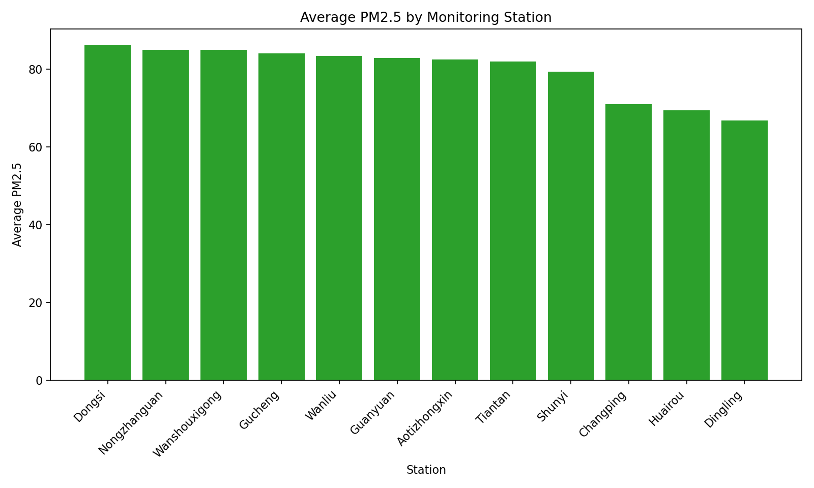
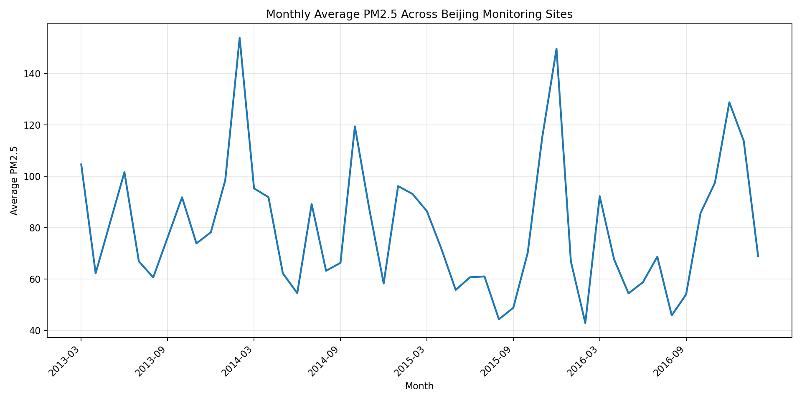
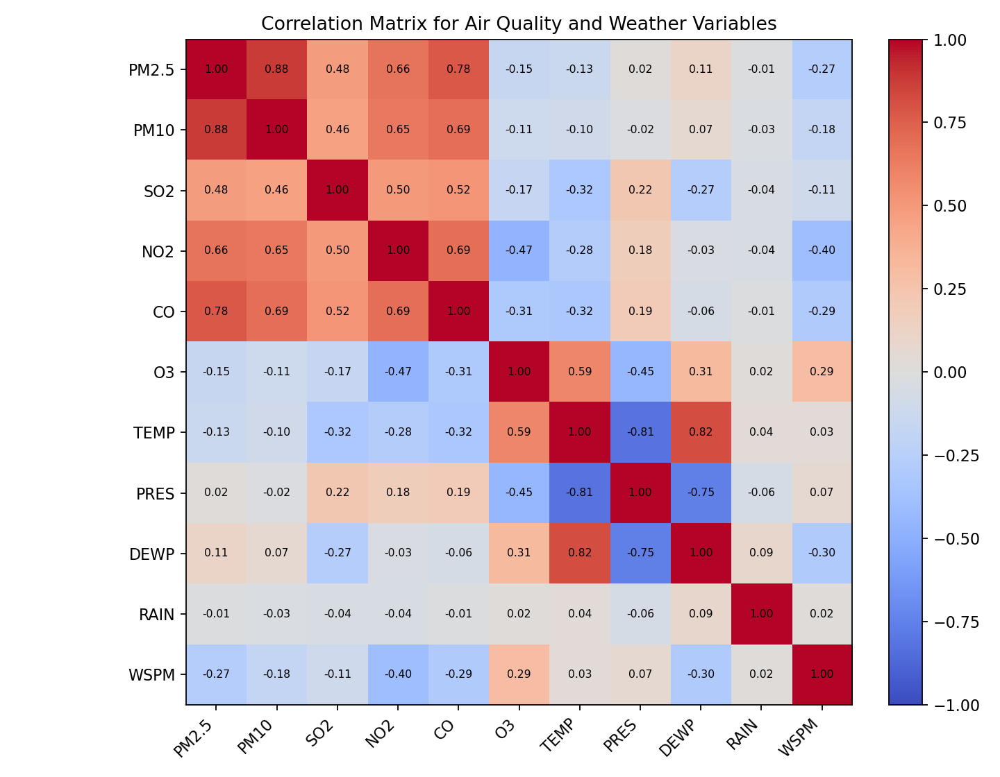
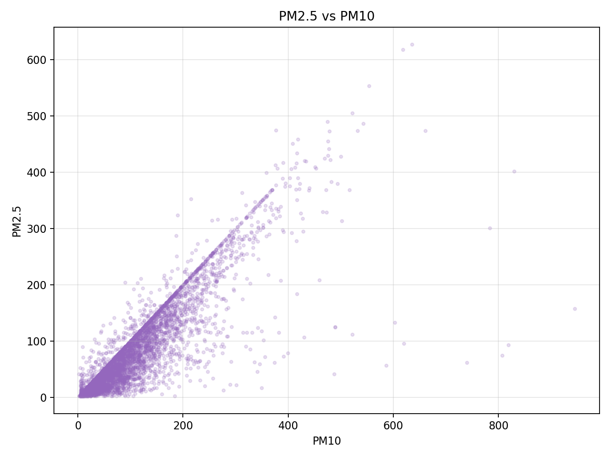

# Week 3 - Activity 3: Beijing Multi-Site Air Quality Statistical Analysis

## Dataset

This project analyses the Beijing Multi-Site Air Quality dataset from the UCI Machine Learning Repository.

Source: https://archive.ics.uci.edu/dataset/501/beijing+multi+site+air+quality+data

Dataset summary:
- Raw records loaded: 420,768
- Cleaned records analysed: 420,768
- Monitoring stations: 12
- Date range: 2013-03-01 to 2017-02-28

## Data Cleaning

The original dataset uses separate `year`, `month`, `day`, and `hour` columns. These were combined into one `datetime` column for time-series analysis.

Missing numeric values were cleaned with station-level time interpolation first. Remaining numeric gaps were filled with station medians and then overall medians if needed. Wind direction was cleaned with the most frequent value for each station.

Missing values before and after cleaning:

| Column | Missing Before Cleaning | Missing After Cleaning | Missing Reduction |
| --- | --- | --- | --- |
| No | 0 | 0 | 0 |
| year | 0 | 0 | 0 |
| month | 0 | 0 | 0 |
| day | 0 | 0 | 0 |
| hour | 0 | 0 | 0 |
| PM2.5 | 8739 | 0 | 8739 |
| PM10 | 6449 | 0 | 6449 |
| SO2 | 9021 | 0 | 9021 |
| NO2 | 12116 | 0 | 12116 |
| CO | 20701 | 0 | 20701 |
| O3 | 13277 | 0 | 13277 |
| TEMP | 398 | 0 | 398 |
| PRES | 393 | 0 | 393 |
| DEWP | 403 | 0 | 403 |
| RAIN | 390 | 0 | 390 |
| wd | 1822 | 0 | 1822 |
| WSPM | 318 | 0 | 318 |
| station | 0 | 0 | 0 |
| datetime | 0 | 0 | 0 |

## Descriptive Statistics

The table below summarises the major pollutant and weather variables. It includes count, mean, median, sample variance, sample standard deviation, minimum, and maximum.

| Variable | count | mean | median | var | std | min | max |
| --- | --- | --- | --- | --- | --- | --- | --- |
| PM2.5 | 420,768.00 | 79.84 | 55.00 | 6,552.94 | 80.95 | 2.00 | 999.00 |
| PM10 | 420,768.00 | 104.91 | 82.00 | 8,543.57 | 92.43 | 2.00 | 999.00 |
| SO2 | 420,768.00 | 15.91 | 7.00 | 479.46 | 21.90 | 0.29 | 500.00 |
| NO2 | 420,768.00 | 50.60 | 43.00 | 1,237.06 | 35.17 | 1.03 | 290.00 |
| CO | 420,768.00 | 1,235.68 | 900.00 | 1,349,758.08 | 1,161.79 | 100.00 | 10,000.00 |
| O3 | 420,768.00 | 57.24 | 44.00 | 3,264.43 | 57.14 | 0.21 | 1,071.00 |
| TEMP | 420,768.00 | 13.53 | 14.50 | 130.82 | 11.44 | -19.90 | 41.60 |
| PRES | 420,768.00 | 1,010.75 | 1,010.40 | 109.71 | 10.47 | 982.40 | 1,042.80 |
| DEWP | 420,768.00 | 2.48 | 3.00 | 190.38 | 13.80 | -43.40 | 29.10 |
| RAIN | 420,768.00 | 0.06 | 0.00 | 0.67 | 0.82 | 0.00 | 72.50 |
| WSPM | 420,768.00 | 1.73 | 1.40 | 1.55 | 1.25 | 0.00 | 13.20 |

## Station-Level PM2.5 Comparison

The highest average PM2.5 station is **Dongsi** with an average PM2.5 of **86.14**.

The lowest average PM2.5 station is **Dingling** with an average PM2.5 of **66.85**.

| station | PM25_Mean | PM25_Median | PM25_Std | PM10_Mean | NO2_Mean | Record_Count |
| --- | --- | --- | --- | --- | --- | --- |
| Dongsi | 86.14 | 61.00 | 86.26 | 110.35 | 53.95 | 35064 |
| Nongzhanguan | 85.08 | 59.00 | 86.69 | 109.38 | 58.10 | 35064 |
| Wanshouxigong | 85.07 | 60.00 | 86.00 | 112.51 | 55.50 | 35064 |
| Gucheng | 84.07 | 60.00 | 82.99 | 119.26 | 55.82 | 35064 |
| Wanliu | 83.47 | 59.00 | 82.13 | 110.71 | 65.67 | 35064 |
| Guanyuan | 82.90 | 59.00 | 81.07 | 109.37 | 58.14 | 35064 |
| Aotizhongxin | 82.54 | 58.00 | 81.96 | 110.21 | 59.07 | 35064 |
| Tiantan | 82.03 | 58.00 | 80.90 | 106.54 | 53.26 | 35064 |
| Shunyi | 79.44 | 55.00 | 81.50 | 99.27 | 44.09 | 35064 |
| Changping | 70.99 | 46.00 | 72.40 | 94.79 | 44.21 | 35064 |
| Huairou | 69.50 | 47.00 | 70.99 | 92.42 | 32.08 | 35064 |
| Dingling | 66.85 | 41.00 | 73.45 | 84.11 | 27.30 | 35064 |

## Monthly Trend

The chart below shows the monthly average PM2.5 trend across all Beijing monitoring stations.

The most recent 12 monthly averages in the dataset are:

| Month | PM25_Mean | PM10_Mean | O3_Mean |
| --- | --- | --- | --- |
| 2016-03 | 92.19 | 134.40 | 48.74 |
| 2016-04 | 67.60 | 114.09 | 71.47 |
| 2016-05 | 54.38 | 86.90 | 95.86 |
| 2016-06 | 58.70 | 76.03 | 109.54 |
| 2016-07 | 68.67 | 77.18 | 101.20 |
| 2016-08 | 45.81 | 58.08 | 78.49 |
| 2016-09 | 53.97 | 67.96 | 55.18 |
| 2016-10 | 85.59 | 100.70 | 23.77 |
| 2016-11 | 97.44 | 130.32 | 16.74 |
| 2016-12 | 128.73 | 149.57 | 17.87 |
| 2017-01 | 113.73 | 133.72 | 33.97 |
| 2017-02 | 68.80 | 85.60 | 46.58 |

## Correlation Analysis

The strongest absolute correlation with PM2.5 is **PM10**, with a correlation coefficient of **0.88**.

Correlation matrix:

| Variable | PM2.5 | PM10 | SO2 | NO2 | CO | O3 | TEMP | PRES | DEWP | RAIN | WSPM |
| --- | --- | --- | --- | --- | --- | --- | --- | --- | --- | --- | --- |
| PM2.5 | 1.00 | 0.88 | 0.48 | 0.66 | 0.78 | -0.15 | -0.13 | 0.02 | 0.11 | -0.01 | -0.27 |
| PM10 | 0.88 | 1.00 | 0.46 | 0.65 | 0.69 | -0.11 | -0.10 | -0.02 | 0.07 | -0.03 | -0.18 |
| SO2 | 0.48 | 0.46 | 1.00 | 0.50 | 0.52 | -0.17 | -0.32 | 0.22 | -0.27 | -0.04 | -0.11 |
| NO2 | 0.66 | 0.65 | 0.50 | 1.00 | 0.69 | -0.47 | -0.28 | 0.18 | -0.03 | -0.04 | -0.40 |
| CO | 0.78 | 0.69 | 0.52 | 0.69 | 1.00 | -0.31 | -0.32 | 0.19 | -0.06 | -0.01 | -0.29 |
| O3 | -0.15 | -0.11 | -0.17 | -0.47 | -0.31 | 1.00 | 0.59 | -0.45 | 0.31 | 0.02 | 0.29 |
| TEMP | -0.13 | -0.10 | -0.32 | -0.28 | -0.32 | 0.59 | 1.00 | -0.81 | 0.82 | 0.04 | 0.03 |
| PRES | 0.02 | -0.02 | 0.22 | 0.18 | 0.19 | -0.45 | -0.81 | 1.00 | -0.75 | -0.06 | 0.07 |
| DEWP | 0.11 | 0.07 | -0.27 | -0.03 | -0.06 | 0.31 | 0.82 | -0.75 | 1.00 | 0.09 | -0.30 |
| RAIN | -0.01 | -0.03 | -0.04 | -0.04 | -0.01 | 0.02 | 0.04 | -0.06 | 0.09 | 1.00 | 0.02 |
| WSPM | -0.27 | -0.18 | -0.11 | -0.40 | -0.29 | 0.29 | 0.03 | 0.07 | -0.30 | 0.02 | 1.00 |

The PM2.5 and PM10 scatter plot is included because these two pollutants are expected to move together.

## Statistical Interpretation

This analysis uses descriptive statistics to summarise the distribution of each variable and bivariate statistics to describe relationships between variables. The correlation matrix shows association, not causation. For example, a high correlation between PM2.5 and PM10 means they tend to move together, but it does not prove that one pollutant directly causes the other.

The estimated 95% confidence interval for the overall mean PM2.5 is **79.60 to 80.08**, with a sample mean of **79.84**.

## Conclusion

The dataset shows clear variation in air quality across stations and over time. PM2.5 differs by monitoring site, changes across months, and is associated with other pollutant variables. However, because this is observational data, the results should be interpreted as statistical relationships rather than direct causal effects.
