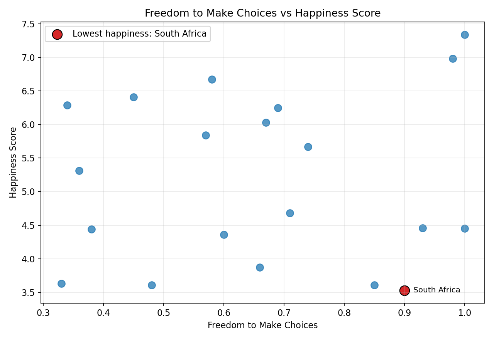

# Week 4 - Activity 1.2: Happiness Dashboard with Outlier Detection

## Objective

This activity updates the Week 4 Activity 1.1 happiness dashboard by adding outlier detection. The dashboard identifies the three happiest countries, compares their happiness scores, summarises the Freedom score for the country with the lowest happiness score, and checks whether any numeric records should be kept or dropped after outlier review.

Both Matplotlib and Plotly are used to demonstrate static and interactive visualisation skills.

## Data Preparation

The dataset contains **20 records** and **8 columns** after cleaning.

Cleaning and preparation steps:
- Standardised column names and country names by removing extra whitespace.
- Converted all score columns to numeric values.
- Checked missing values.
- Checked duplicate rows.
- Sorted records by `Happiness_Score` for ranking.

Duplicate rows found: **0**

### Data Quality Check: Missing Values

No missing values were found in the provided dataset, so no missing-value imputation was required.

### Data Quality Check: Outliers

Outlier detection was added for Activity 1.2. The dashboard uses the IQR method from the sample exercise to check all numeric columns. The IQR method flags values below `Q1 - 1.5 * IQR` or above `Q3 + 1.5 * IQR`.

The IQR method did not identify any outlier records in the numeric columns. Therefore, all country records were kept and no outlier removal was applied.

| Indicator | Q1 | Q3 | IQR | Lower_Bound | Upper_Bound | Outlier_Count | Decision |
| --- | --- | --- | --- | --- | --- | --- | --- |
| Happiness_Score | 4.24 | 6.26 | 2.02 | 1.20 | 9.29 | 0 | Keep all records |
| GDP_per_Capita | 0.91 | 1.40 | 0.49 | 0.18 | 2.13 | 0 | Keep all records |
| Social_Support | 0.52 | 0.77 | 0.25 | 0.15 | 1.15 | 0 | Keep all records |
| Healthy_Life_Expectancy | 51.18 | 73.30 | 22.12 | 17.99 | 106.49 | 0 | Keep all records |
| Freedom_to_Make_Choices | 0.47 | 0.86 | 0.39 | -0.11 | 1.45 | 0 | Keep all records |
| Generosity | 0.16 | 0.41 | 0.26 | -0.22 | 0.80 | 0 | Keep all records |
| Perceptions_of_Corruption | 0.19 | 0.73 | 0.54 | -0.62 | 1.54 | 0 | Keep all records |

The boxplot below uses the original value scale for each indicator. The red dashed lines show the IQR lower and upper bounds. A country point outside these bounds would be treated as a potential outlier.

Some IQR bounds may fall outside a score's theoretical range, such as below 0 or above 1. This is acceptable because the bounds are statistical thresholds, not actual observed data values.


Open the interactive Plotly outlier boxplot:

```text
outputs/plotly_outlier_boxplots.html
```

## Three Happiest Countries

The three happiest countries in the dataset are:

| Country | Happiness_Score | Freedom_to_Make_Choices |
| --- | --- | --- |
| Canada | 7.34 | 1.00 |
| Brazil | 6.98 | 0.98 |
| Finland | 6.67 | 0.58 |

The happiest country is **Canada**, with a happiness score of **7.34**.

### Matplotlib Visualisation: Happiness Score Comparison


### Matplotlib Visualisation: Supporting Indicator Profile

The supporting indicators use different scales, so the profile chart uses min-max normalisation. This allows the top three countries to be compared across GDP, social support, healthy life expectancy, freedom, generosity, and perceived corruption on the same visual scale.


### Plotly Visualisation: Interactive Top 3 Chart

Open the interactive Plotly chart:

```text
outputs/plotly_top3_happiness.html
```

## Lowest Happiness Country and Freedom Score

The country with the lowest happiness score is:

| Country | Happiness_Score | Freedom_to_Make_Choices |
| --- | --- | --- |
| South Africa | 3.53 | 0.90 |

The lowest happiness country is **South Africa**, with a happiness score of **3.53** and a Freedom score of **0.90**.

The average Freedom score across the dataset is **0.66**.

To make the Freedom summary more useful, the dashboard compares South Africa with the top three happiest countries and the dataset average. Since `Happiness_Score` and `Freedom_to_Make_Choices` use different scales, `Happiness_Score` is normalised to a 0-1 scale for this comparison.

| Country | Happiness_Score | Freedom_to_Make_Choices | Happiness_Normalised | Freedom_Normalised |
| --- | --- | --- | --- | --- |
| Canada | 7.34 | 1.00 | 1.00 | 1.00 |
| Brazil | 6.98 | 0.98 | 0.95 | 0.98 |
| Finland | 6.67 | 0.58 | 0.91 | 0.58 |
| South Africa | 3.53 | 0.90 | 0.48 | 0.90 |
| Dataset Average | 5.17 | 0.66 | 0.70 | 0.66 |

### Matplotlib Freedom and Happiness Context


### Plotly Freedom and Happiness Context

Open the interactive Plotly grouped bar chart:

```text
outputs/plotly_lowest_country_freedom.html
```

## Supporting Indicator Summary

The table below summarises the supporting indicators across all countries in the dataset. These variables are used for descriptive comparison only. This dashboard does not claim that these indicators cause the Happiness score.

| Indicator | mean | min | max |
| --- | --- | --- | --- |
| GDP_per_Capita | 1.15 | 0.60 | 1.57 |
| Social_Support | 0.62 | 0.43 | 0.96 |
| Healthy_Life_Expectancy | 62.29 | 41.30 | 81.60 |
| Freedom_to_Make_Choices | 0.66 | 0.33 | 1.00 |
| Generosity | 0.30 | 0.01 | 0.57 |
| Perceptions_of_Corruption | 0.50 | 0.10 | 0.86 |

### Matplotlib Scatter Plot: Freedom vs Happiness

The static scatter plot below focuses specifically on the relationship between `Freedom_to_Make_Choices` and `Happiness_Score`. A scatter plot is appropriate here because both variables are numeric, and the goal is to inspect whether countries with higher Freedom scores also tend to have higher Happiness scores.



## Correlation Analysis

The table below shows the correlation between `Happiness_Score` and each supporting indicator.

| Indicator | Correlation_with_Happiness |
| --- | --- |
| Healthy_Life_Expectancy | 0.16 |
| Freedom_to_Make_Choices | 0.08 |
| Social_Support | 0.02 |
| GDP_per_Capita | 0.01 |
| Generosity | -0.15 |
| Perceptions_of_Corruption | -0.34 |

The strongest positive association with Happiness score is **Healthy_Life_Expectancy** with a correlation of **0.16**.

The weakest or most negative association is **Perceptions_of_Corruption** with a correlation of **-0.34**.

The heatmap below shows the full correlation matrix for `Happiness_Score` and all supporting indicators. It is useful because it shows not only each indicator's relationship with happiness, but also the relationships among the indicators themselves.


These correlations describe relationships in this dataset only. They do not prove that any indicator causes Happiness score to increase or decrease.

## Chart Choice

A bar chart is the most appropriate chart type for comparing the happiness scores of the three happiest countries because the countries are categorical variables and the happiness score is numeric. A line chart is not suitable because this dataset does not contain a time variable. A grouped bar chart is also appropriate for the lowest-happiness country task because it compares South Africa's Freedom score with its normalised Happiness score and with other countries. Scatter plots are useful for exploring relationships between two numeric variables, such as Freedom and Happiness. A correlation heatmap is more appropriate than a correlation bar chart when comparing several numeric variables because it shows the strength and direction of all pairwise relationships in one view.

## Findings

- The top three happiest countries are Canada, Brazil, and Finland.
- Canada has the highest happiness score in this dataset.
- South Africa has the lowest happiness score.
- South Africa's Freedom score is relatively high compared with its happiness score, which suggests that the Happiness score should not be interpreted through Freedom alone in this dataset.
- The IQR outlier check did not identify any outlier records, so all records were kept.
- The supporting indicators are useful for descriptive comparison, but the dashboard does not make causal claims about their effect on Happiness score.
- Correlation analysis helps identify which supporting indicators are more strongly associated with Happiness score, but it should not be interpreted as causation.
