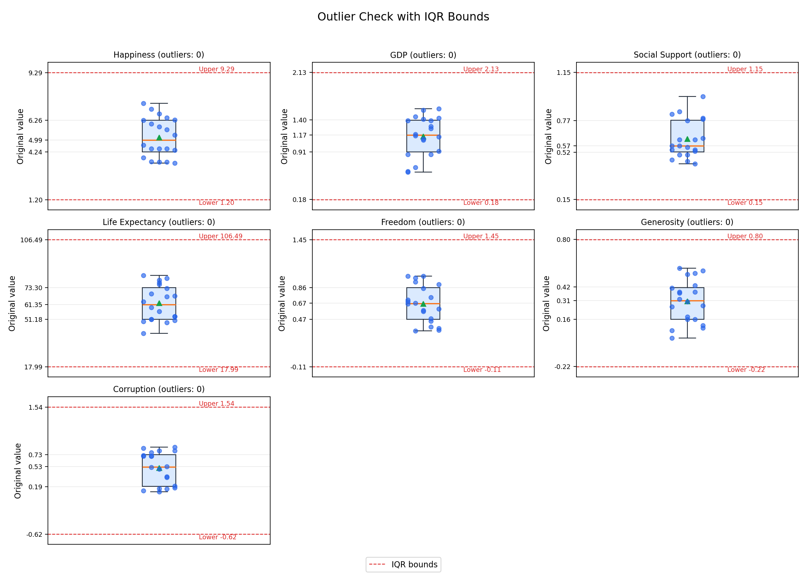

# Week 4 - Activity 1.2: Outlier Detection

## Objective

This update adds outlier detection to the Week 4 Activity 1.1 Happiness Dashboard. Outliers are data points that differ noticeably from the rest of the dataset. They may be caused by data entry issues, measurement problems, or genuine variability between countries. Checking them helps improve data quality before visualisation, reduces the risk of misleading findings, and supports a justified keep/drop decision.

## Method

The analysis uses the **IQR method**, following the approach demonstrated in the provided outlier sample code. IQR is appropriate here because it is simple, robust, and does not require the data to follow a normal distribution.

For each numeric column:

- Q1 is the 25th percentile.
- Q3 is the 75th percentile.
- IQR is calculated as `Q3 - Q1`.
- A value is flagged as a potential outlier if it is lower than `Q1 - 1.5 * IQR` or higher than `Q3 + 1.5 * IQR`.

The Z-score method is another common option, but it is more suitable when the data is approximately normally distributed. Since this dataset is small and contains different country-level indicators, IQR is a more practical choice for this activity.

## Code Implementation

The outlier detection is implemented in `happiness_dashboard.py`.

Main code sections:

- `load_and_clean_data()` loads `world_happiness_dataset.csv`, standardises the column and country names, converts numeric fields to numeric data types, checks missing values, checks duplicate rows, and prepares the cleaned dataset.
- `detect_outliers_iqr()` performs the actual outlier detection. It loops through every numeric column, calculates Q1, Q3, IQR, lower bound, and upper bound, then checks whether any country value falls outside those bounds.
- `create_matplotlib_outlier_boxplots()` creates the static boxplot image. Each indicator is shown in a separate panel using its original value scale. The red dashed lines show the IQR lower and upper bounds.
- `save_outputs()` saves the cleaned dataset, the key analysis CSV files, and generated charts into the `outputs/` folder.

The main logic is:

1. Read and clean the dataset.
2. Select all numeric columns used in the dashboard.
3. Calculate IQR thresholds for each numeric column.
4. Flag values below the lower bound or above the upper bound.
5. Save `outlier_summary.csv` as evidence for the IQR calculation.
6. Generate Matplotlib and Plotly boxplots to visually check the outlier result.
7. Decide whether to keep or drop records based on the IQR result and the meaning of the data.

## Columns Checked

The dataset contains **20 records**. Outlier detection was applied to **7 numeric columns**:

- `Happiness_Score`
- `GDP_per_Capita`
- `Social_Support`
- `Healthy_Life_Expectancy`
- `Freedom_to_Make_Choices`
- `Generosity`
- `Perceptions_of_Corruption`

## Outlier Summary

| Indicator | Q1 | Q3 | IQR | Lower_Bound | Upper_Bound | Outlier_Count | Decision |
| --- | --- | --- | --- | --- | --- | --- | --- |
| Happiness_Score | 4.24 | 6.26 | 2.02 | 1.20 | 9.29 | 0 | Keep all records |
| GDP_per_Capita | 0.91 | 1.40 | 0.49 | 0.18 | 2.13 | 0 | Keep all records |
| Social_Support | 0.52 | 0.77 | 0.25 | 0.15 | 1.15 | 0 | Keep all records |
| Healthy_Life_Expectancy | 51.18 | 73.30 | 22.12 | 17.99 | 106.49 | 0 | Keep all records |
| Freedom_to_Make_Choices | 0.47 | 0.86 | 0.39 | -0.11 | 1.45 | 0 | Keep all records |
| Generosity | 0.16 | 0.41 | 0.26 | -0.22 | 0.80 | 0 | Keep all records |
| Perceptions_of_Corruption | 0.19 | 0.73 | 0.54 | -0.62 | 1.54 | 0 | Keep all records |

## Flagged Records

No individual country records were flagged as outliers.

## Decision: Keep or Drop

The IQR method did not identify any outlier records in the numeric columns. Therefore, all country records were kept and no outlier removal was applied.

In this dataset, country-level differences can be meaningful real-world observations. A high or low value should not be removed only because it is unusual. A record should be dropped only if there is evidence of a data entry error, impossible value, or duplicated/invalid record.

## Visual Check

The Matplotlib and Plotly boxplots use the original value scale for each indicator. The red dashed lines show the IQR lower and upper bounds. A country point outside these bounds would be treated as a potential outlier.

Because the indicators use different scales, the visual is split into separate panels. This makes the outlier boundary for each indicator easier to read than using one shared 0-1 normalised axis.

Some IQR bounds may fall outside a score's theoretical range, such as below 0 or above 1. This is acceptable because the bounds are statistical thresholds, not actual observed data values.



Open the interactive Plotly outlier boxplot:

```text
outputs/plotly_outlier_boxplots.html
```
