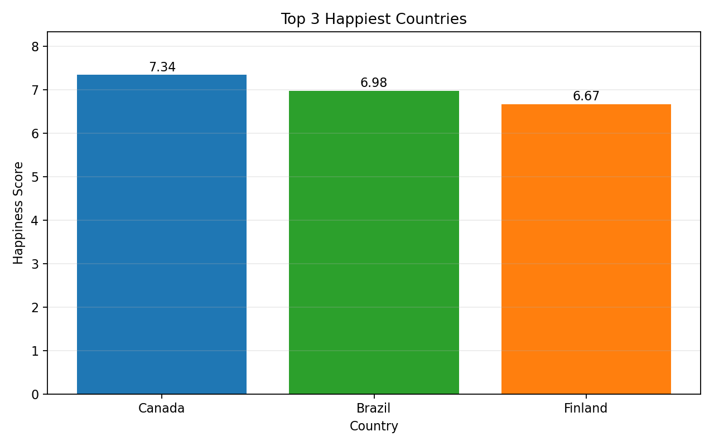
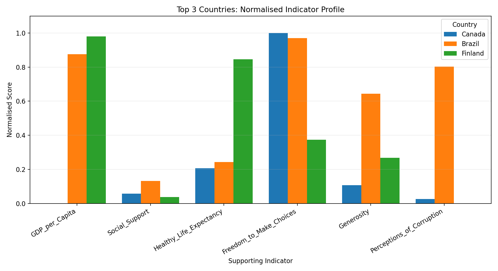
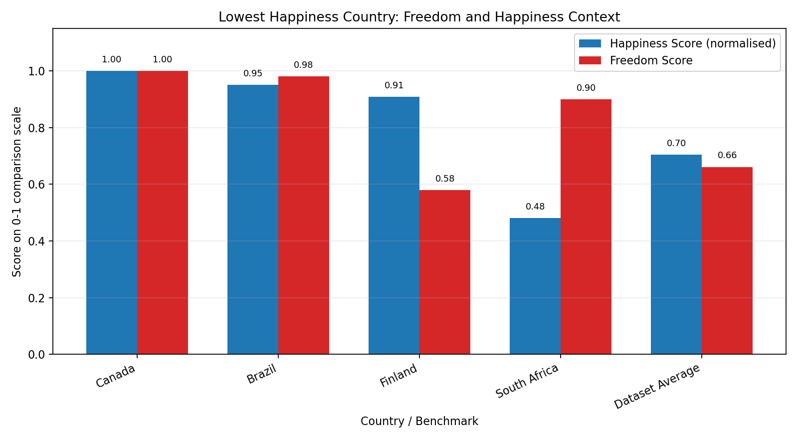
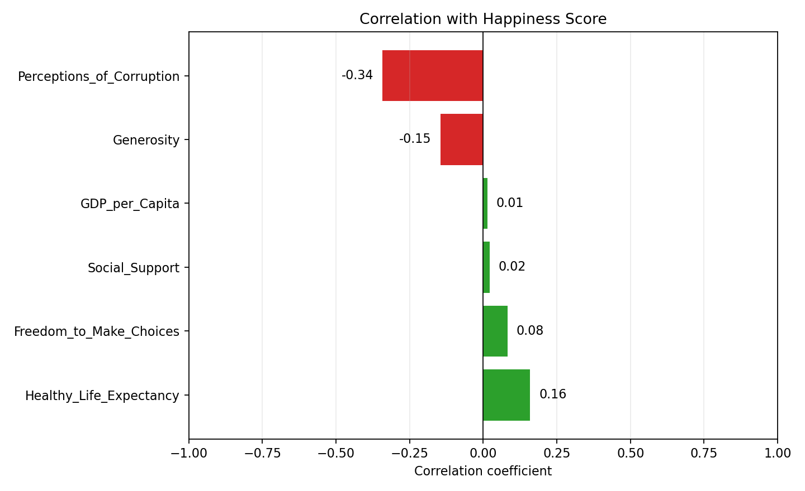

# Week 4 - Activity 1: Happiness Dashboard and Data Visualisation

## Objective

This activity develops a simple dashboard using the cleaned World Happiness dataset. The dashboard identifies the three happiest countries, compares their happiness scores, and summarises the Freedom score for the country with the lowest happiness score.

Both Matplotlib and Plotly are used to demonstrate static and interactive visualisation skills.

## Data Preparation

The dataset contains **$record_count records** and **$column_count columns** after cleaning.

Cleaning and preparation steps:
- Standardised column names and country names by removing extra whitespace.
- Converted all score columns to numeric values.
- Checked missing values.
- Checked duplicate rows.
- Sorted records by `Happiness_Score` for ranking.

Duplicate rows found: **$duplicate_count**

Missing values summary:

$missing_table

## Three Happiest Countries

The three happiest countries in the dataset are:

$top3_table

The happiest country is **$top_country**, with a happiness score of **$top_score**.

### Matplotlib Visualisation: Happiness Score Comparison



### Matplotlib Visualisation: Supporting Indicator Profile

The supporting indicators use different scales, so the profile chart uses min-max normalisation. This allows the top three countries to be compared across GDP, social support, healthy life expectancy, freedom, generosity, and perceived corruption on the same visual scale.



### Plotly Visualisation: Interactive Top 3 Chart

Open the interactive Plotly chart:

```text
outputs/plotly_top3_happiness.html
```

## Lowest Happiness Country and Freedom Score

The country with the lowest happiness score is:

$lowest_table

The lowest happiness country is **$lowest_country**, with a happiness score of **$lowest_happiness** and a Freedom score of **$lowest_freedom**.

The average Freedom score across the dataset is **$freedom_average**.

To make the Freedom summary more useful, the dashboard compares South Africa with the top three happiest countries and the dataset average. Since `Happiness_Score` and `Freedom_to_Make_Choices` use different scales, `Happiness_Score` is normalised to a 0-1 scale for this comparison.

$lowest_comparison_table

### Matplotlib Freedom and Happiness Context



### Plotly Freedom and Happiness Context

Open the interactive Plotly grouped bar chart:

```text
outputs/plotly_lowest_country_freedom.html
```

## Supporting Indicator Summary

The table below summarises the supporting indicators across all countries in the dataset. These variables are used for descriptive comparison only. This dashboard does not claim that these indicators cause the Happiness score.

$supporting_summary_table

### Plotly Relationship View

Open the interactive Plotly scatter chart:

```text
outputs/plotly_happiness_freedom_relationship.html
```

This chart places `Freedom_to_Make_Choices` on the x-axis and `Happiness_Score` on the y-axis. Marker size represents `GDP_per_Capita`, colour represents `Social_Support`, and hover text shows the remaining indicators. This makes the dashboard use the wider dataset instead of relying only on the Happiness and Freedom columns.

## Correlation Analysis

The table below shows the correlation between `Happiness_Score` and each supporting indicator.

$correlation_table

The strongest positive association with Happiness score is **$strongest_positive_indicator** with a correlation of **$strongest_positive_correlation**.

The weakest or most negative association is **$strongest_negative_indicator** with a correlation of **$strongest_negative_correlation**.



Open the interactive Plotly correlation chart:

```text
outputs/plotly_happiness_correlations.html
```

These correlations describe relationships in this dataset only. They do not prove that any indicator causes Happiness score to increase or decrease.

## Chart Choice

A bar chart is the most appropriate chart type for comparing the happiness scores of the three happiest countries because the countries are categorical variables and the happiness score is numeric. A line chart is not suitable because this dataset does not contain a time variable. A grouped bar chart is also appropriate for the lowest-happiness country task because it compares South Africa's Freedom score with its normalised Happiness score and with other countries. The scatter chart is useful for exploring relationships between Happiness and other supporting indicators, while the correlation bar chart summarises the strength and direction of those associations.

## Findings

- The top three happiest countries are Canada, Brazil, and Finland.
- Canada has the highest happiness score in this dataset.
- South Africa has the lowest happiness score.
- South Africa's Freedom score is relatively high compared with its happiness score, which suggests that the Happiness score should not be interpreted through Freedom alone in this dataset.
- The supporting indicators are useful for descriptive comparison, but the dashboard does not make causal claims about their effect on Happiness score.
- Correlation analysis helps identify which supporting indicators are more strongly associated with Happiness score, but it should not be interpreted as causation.
