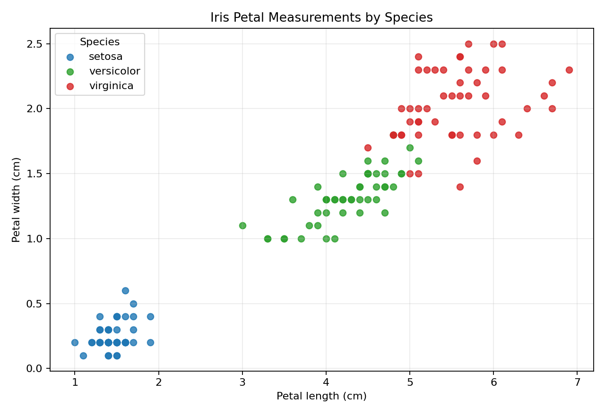
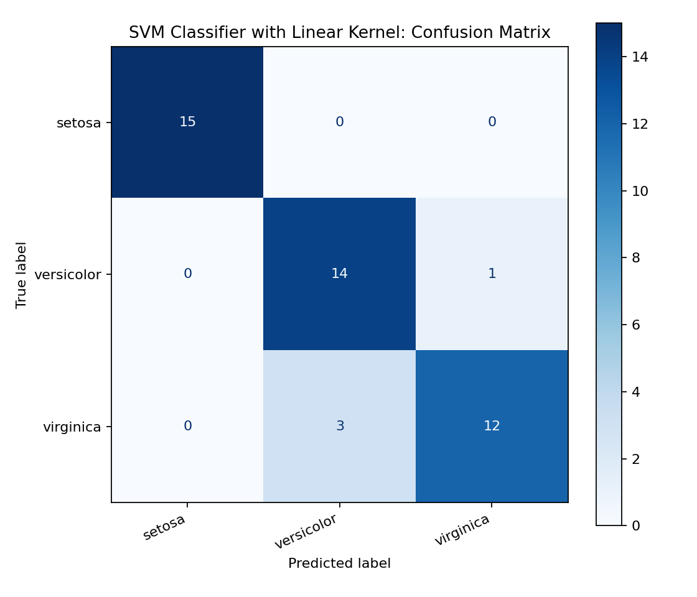

# Week 5 - Activity 1: SVM Classification on Iris Dataset

## Objective

This activity uses a Support Vector Machine (SVM) classifier to predict Iris species from flower measurements. The target variable is `species`, and the input features are sepal length, sepal width, petal length, and petal width.

The implementation follows the main idea from the scikit-learn SVM guide: create an `SVC` classifier, fit it with feature data `X` and class labels `y`, then use the trained model to predict Iris species.

## Dataset and Cleaning

The dataset is loaded from scikit-learn:

```text
datasets.load_iris()
```

The dataset contains 150 records and 3 balanced classes:

| Species | Count |
| --- | --- |
| setosa | 50 |
| versicolor | 50 |
| virginica | 50 |

Cleaning steps:

- Loaded the Iris data directly from `datasets.load_iris()`.
- Defined `x = iris.data` as the four flower measurement features.
- Defined `y = iris.target` as the three flower species classes.
- Used the clean dataset provided by scikit-learn for model training and testing.

No missing values were found.

## Method

The script is:

```text
iris_svm_classification.py
```

Main logic:

1. Load and prepare the Iris data from scikit-learn.
2. Define `x = iris.data` as the four flower measurements.
3. Define `y = iris.target` as the three Iris species classes.
4. Split the 150 records into training and testing sets using a 70/30 split: 105 records for training and 45 records for testing.
5. Standardise the four feature columns using `StandardScaler` from `sklearn.preprocessing`.
6. Train one SVM classifier using `SVC(kernel="linear")`.
7. Use the trained model to predict the test set.
8. Evaluate the result using accuracy, a classification report, and a confusion matrix.

This is a multi-class classification task because `y` contains three classes: `setosa`, `versicolor`, and `virginica`. The `SVC` classifier can handle these three class labels directly.

The split uses `random_state=42` so that the same records are selected for training and testing each time the script is run. The number 42 has no special statistical meaning; it is simply a fixed seed. Using a fixed seed makes the result reproducible, which is useful when submitting and explaining the work.

The scaler uses `fit_transform()` on the training data and `transform()` on the test data. This keeps the train/test split separate while applying the same scaling rule to both sets.

If a different result is obtained, the main reasons are usually a different `random_state`, which changes the train/test samples, or a different SVM `kernel`, which changes the decision boundary used by the classifier.

## Data Visualisation



This scatter plot uses petal length and petal width to show the Iris dataset before classification. Each point represents one flower sample, and the colour represents its species class.

The plot helps this task because it shows that the classes have visible patterns in the feature space. `setosa` is clearly separated, while `versicolor` and `virginica` are closer to each other. This helps explain why an SVM classifier can learn boundaries between the three classes.

## Model Results

| Model | Kernel | Accuracy | Weighted Precision | Weighted Recall |
| --- | --- | --- | --- | --- |
| SVM Classifier (SVC) | linear | 0.9111 | 0.9155 | 0.9111 |

The SVM classifier correctly predicted 41 of the 45 test samples. The accuracy is therefore **0.9111**, which means about 91.11% of the selected test samples were classified correctly.

## Confusion Matrix



The confusion matrix shows that all 15 `setosa` samples were classified correctly. The model made four errors between `versicolor` and `virginica`, which is reasonable because these two classes are closer to each other in the feature space.

## Conclusion

SVM is suitable for the Iris classification task because the dataset has numeric measurements and three clearly defined species classes. With the selected 70/30 train/test split, the linear SVM classifier achieved 91.11% accuracy on the test set.
